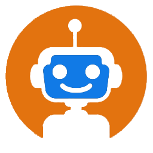

[](https://www.typescriptlang.org/)
[](https://github.com/)
[](https://aralium.fr/)

<!-- PROJECT LOGO -->
<br />
<p align="center">
  <a href="https://github.com/thibaultcrn1/permasense-corrosion-app-example">
    
  </a>

  <h3 align="center">permasense-corrosion-app-example</h3>

  <p align="center">
    Angular Application Example
    <br />
    <a href="https://github.com/thibaultcrn1/permasense-corrosion-app-example">Voir la démo</a>
    ·
    <a href="https://github.com/thibaultcrn1/permasense-corrosion-app-example/issues">Rapporté une erreur</a>
    ·
    <a href="https://github.com/thibaultcrn1/permasense-corrosion-app-example/issues">Demande de fonctionnalité</a>
  </p>
</p>
<br />
<br />

## Fabriqué avec
<!-- MADE WITH-->
* [NodeJS](https://nodejs.org/en/)
* [Angular](https://angular.io/)
<br />

## Installation

1. Cloner le repo
   ```sh
   git clone https://github.com/thibaultcrn1/permasense-corrosion-app-example.git
   ```
2. Démarrer le script start.
   ```sh
   npm run start
   ```
   
<br />
<br />

<!-- ROADMAP -->
## Feuille de route

Voir les [issues](https://github.com/thibaultcrn1/permasense-corrosion-app-example/issues) pour une liste des fonctionnalités proposées (et des problèmes connus).
<br />
<br />
<br />

<!-- CONTRIBUTING -->
## Contribuant

Les contributions sont ce qui fait de la communauté open source un endroit incroyable pour apprendre, inspirer et créer. Toute contribution que vous faites est **grandement appréciée**.

1. Fork le projet
2. Créez votre branche (`git checkout -b feature/AmazingFeature`)
3. Validez vos modifications (`git commit -m 'Add some AmazingFeature'`)
4. Pousser votre branche (`git push origin feature/AmazingFeature`)
5. Ouvrir une Pull Request
<br />

<!-- LICENSE -->
## License

Distribué sous la licence MIT. Voir `LICENSE` pour plus d'informations.
<br />
<br />

<!-- CONTACT -->
## Contacter

Thibault - [@thibaultcrn1](https://github.com/thibaultcrn1) - tcarron6@outlook.com

Lien du projet: [https://github.com/thibaultcrn1/permasense-corrosion-app-example](https://github.com/thibaultcrn1/permasense-corrosion-app-example)


# AngularHelloWorldApp

This project was generated with [Angular CLI](https://github.com/angular/angular-cli) version 12.0.0.

## Development server

Run `ng serve` for a dev server. Navigate to `http://localhost:4200/`. The app will automatically reload if you change any of the source files.

## Code scaffolding

Run `ng generate component component-name` to generate a new component. You can also use `ng generate directive|pipe|service|class|guard|interface|enum|module`.

## Build

Run `ng build` to build the project. The build artifacts will be stored in the `dist/` directory. Use the `--prod` flag for a production build.

## Running unit tests

Run `ng test` to execute the unit tests via [Karma](https://karma-runner.github.io).

## Running end-to-end tests

Run `ng e2e` to execute the end-to-end tests via a platform of your choice.

## Further help

To get more help on the Angular CLI use `ng help` or go check out the [Angular CLI Overview and Command Reference](https://angular.io/cli) page.

